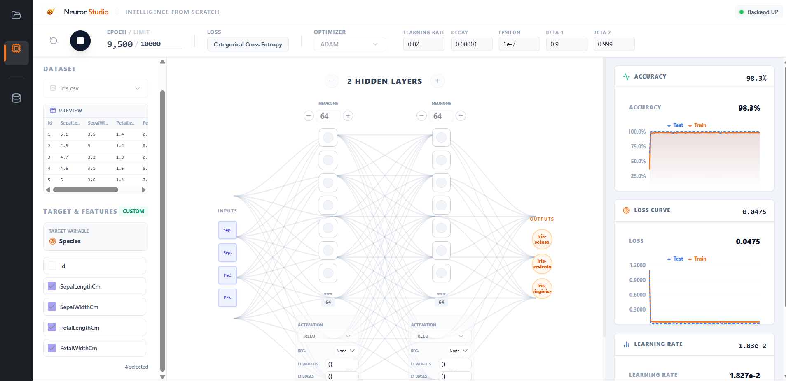
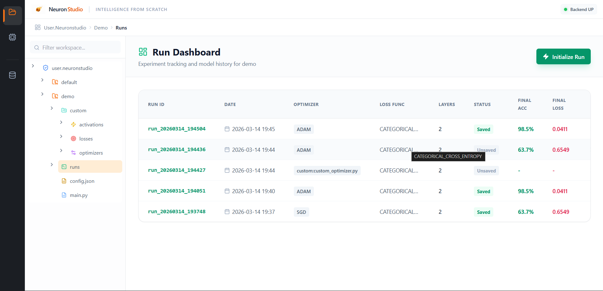
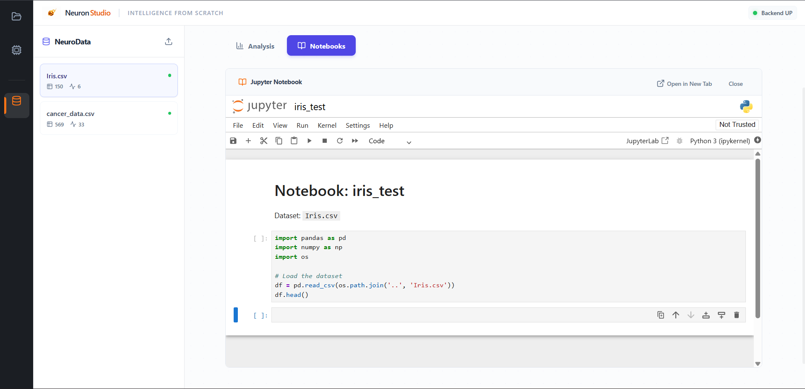
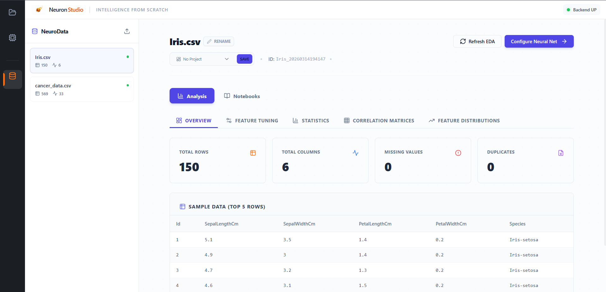

<p align="center">
  
</p>

<h1 align="center">NeuronStudio</h1>

<p align="center">
  
  
  
</p>

**NeuronStudio** is a full-stack neural network visualization and training laboratory that enables researchers and engineers to design, train, and analyze neural architectures from scratch without relying on heavy deep learning frameworks.

---

## 🎨 Application Overview

| **Architecture Designer** | **Data Management** |
| :---: | :---: |
|  |  |

| **Jupyter Integration** | **Project Workspace** |
| :---: | :---: |
|  |  |

---

## 🚀 Key Features

### 🏗️ Visual Architecture Builder
Design complex multi-layer perceptrons through an intuitive drag-and-drop-style interface. Configure neuron counts, activation functions (ReLU, Softmax, Sigmoid), and regularization parameters (L1/L2) per layer.

### 🧪 Advanced Training Telemetry
Monitor model convergence live with real-time accuracy and loss metrics. The system provides a high-fidelity visualization of training dynamics, enabling rapid hyperparameter tuning and architectural iteration.

### 📊 Deep Data Analysis & EDA
Upload custom datasets in CSV or JSON formats. The platform automatically performs exploratory data analysis, generates statistical summaries, and prepares shuffled train/test splits for robust evaluation.

### 📓 Seamless Jupyter Notebook Integration
NeuronStudio bridges the gap between interactive visualization and deep-dive analysis.
- **Auto-Generated Boilerplate**: Instantly create Jupyter Notebooks directly within your dataset folders.
- **Ready-to-Run Code**: Notebooks come pre-configured with the necessary imports and logic to load your current dataset splits accurately.
- **Custom Research**: Use the full power of the Python ecosystem (Pandas, Scikit-Learn, Matplotlib) to perform ad-hoc analysis or verify model outputs outside the GUI.

---

## 📂 Project Structure

```text
├── Engine/                 # Core Neural Network Engine (NumPy-based)
│   └── custom_neural_network/
│       ├── core/           # Layer, Activation, Optimizer, and Loss implementations
│       └── Build/          # Utility scripts for standalone network builds
├── assets/                 # Branding, logos, and documentation assets
├── backend/                # FastAPI Application
│   ├── routes/             # API Endpoint definitions
│   ├── services/           # Business logic and Neural Engine integration
│   ├── models/             # Database schemas and data models
│   └── data/               # Persistent storage (SQLite DB and local datasets)
├── frontend/               # React Application (Vite + Tailwind CSS)
│   ├── src/
│   │   ├── components/     # UI Components (Architecture, Data, Workspace)
│   │   ├── services/       # API and WebSocket communication
│   │   └── App.jsx         # Main application shell
│   └── public/             # Static assets for the frontend
└── README.md               # Main project documentation
```

---

## 🛠️ Tech Stack

- **Frontend**: React.js, Tailwind CSS, Recharts for dynamic telemetry.
- **Backend**: FastAPI, SQLAlchemy, SQLite.
- **Neural Engine**: Custom-built optimization engine using NumPy (Adam, RMSProp, SGD).
- **Service Layer**: WebSockets for low-latency training communication.

---

## ⚙️ Installation & Setup

### Prerequisites

- **Python 3.10+**
- **Node.js 16+**

### 1. Backend Service

1. Navigate to the backend directory:
   ```bash
   cd backend
   ```
2. Set up a virtual environment:
   ```bash
   python -m venv venv
   source venv/bin/activate  # Or `.\venv\Scripts\activate` on Windows
   ```
3. Install dependencies:
   ```bash
   pip install -r requirements.txt
   ```
4. Start the server:
   ```bash
   uvicorn main:app --reload
   ```

### 2. Frontend Application

1. Navigate to the frontend directory:
   ```bash
   cd frontend
   ```
2. Install packages:
   ```bash
   npm install
   ```
3. Start the dev server:
   ```bash
   npm run dev
   ```

---

*Developed as a laboratory for neural network mechanics. Intelligence, built from scratch.*
